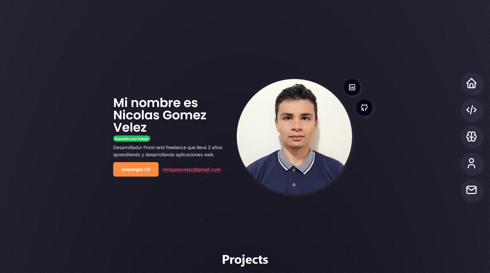
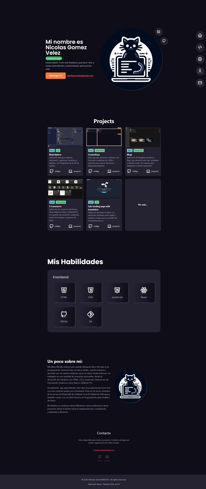

# Portafolio v2 hecho con React, TailwindCSS 

## Contenido
- [Links](#links)
- [Descripcion](#descripcion)
- [Que aprendi](#que-aprendi)
- [Tecnologías usadas](#tecnologías-usadas)
- [vista preview](#vista-preview)
- [Autor](#autor)

## Links 
- https://nickgv-portfolio.netlify.app

## Descripcion
Este porfolio fue creado basandome en muchos distintos porfolios vistos en esta pagina [Porfolio Ideas](https://portfolio-ideas.vercel.app/), pero siempre respetando mi estilo y la idea que tenia en mente.

## Que aprendi

- Aprendi que hacer el diseño antes de empezar a programar, me ayudo a tener una mejor idea de como iba a quedar cada sección y como iba a ser la navegación.
- Aprendi a usar de una mejor forma git, los mensajes de commit, la creacion de las branches, etc.
- Aprendi a 

## Tecnologías usadas

 

## vista preview

## Autor
### Nicolas Gomez Velez
- nickgomvelez@gmail.com
- [Linkedin](https://www.linkedin.com/in/nicol%C3%A1s-g%C3%B3mez-902361274/)
- [GitHub](https://github.com/NickGV)
- [Portfolio](https://nickgv-portfolio.netlify.app/)

